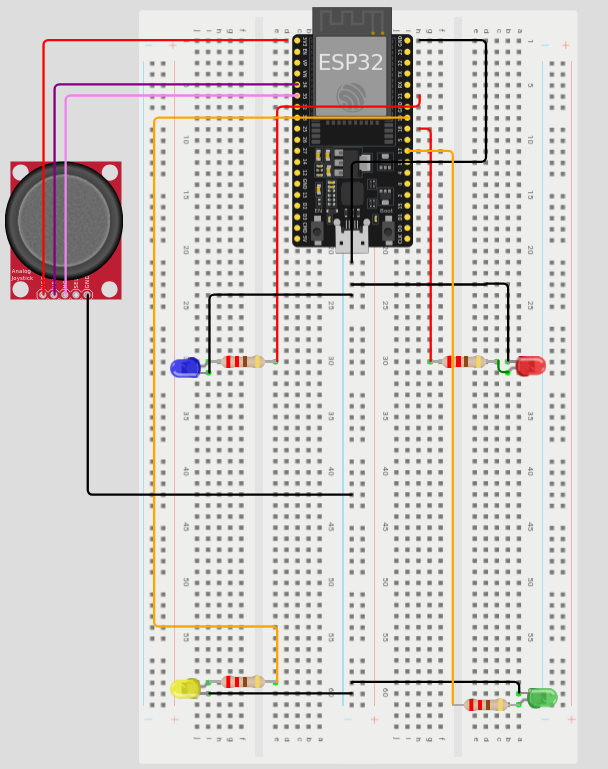

# OdorWatch - Projet IoT

Bienvenue dans le projet **OdorWatch** ! Ce projet a pour but de développer une solution IoT innovante qui permet de mesurer la qualité de l'air dans des cabines de toilettes. Grâce à divers capteurs, notre système évalue en temps réel des paramètres comme les COV, la température et la concentration de gaz afin de déterminer si une cabine est "supportable" après utilisation. Le résultat est affiché sur un écran, et en cas de mauvaise qualité d’air, une ventilation (et même un désodorisant) peut être activée.

---

## Table des Matières

1. [Introduction](#introduction)
2. [Contexte et Motivation](#contexte-et-motivation)
3. [Objectifs du Projet](#objectifs-du-projet)
4. [Matériel et Capteurs Utilisés](#matériel-et-capteurs-utilisés)
5. [Architecture du Système](#architecture-du-système)
6. [Schéma d'Assemblage](#schéma-dassemblage)
7. [Photo de la Breadboard](#photo-de-la-breadboard)
8. [Installation de MicroPython et Thonny](#installation-de-micropython-et-thonny)
9. [Conclusion](#conclusion)

---

## Introduction

Le projet **OdorWatch** vise à surveiller la qualité de l'air dans les cabines de toilettes. À l'aide de capteurs spécialisés, le système recueille et analyse des données pour déterminer l’état de la cabine. Une fois l’analyse effectuée, un indicateur (écran LCD) affiche si la cabine est disponible ou s'il faut encore ventiler l’air.

---

## Contexte et Motivation

Dans les environnements à forte fréquentation, garantir une bonne qualité d'air dans des espaces confinés est crucial pour l'hygiène et le confort. OdorWatch répond à ce besoin en :

- Fournissant une surveillance en temps réel de l’air.
- Automatisant la gestion et la maintenance des cabines.
- Améliorant le confort des utilisateurs.

---

## Objectifs du Projet

- **Mesure en temps réel :** Collecter des données (COV, température, gaz, etc.) via des capteurs.
- **Analyse et évaluation :** Comparer les mesures à des seuils prédéfinis pour déterminer l’état de la cabine.
- **Affichage de l’état :** Indiquer clairement si la cabine est occupée ou libre grâce à un écran LCD.
- **Simulation de ventilation :** Activer un ventilateur (et diffuser du désodorisant) pour améliorer la qualité de l'air après utilisation.

---

## Matériel et Capteurs Utilisés

- **MBE680 :** Capteur multi-gaz (COV, température, humidité).
- **MQ-135 :** Capteur de qualité d’air pour détecter divers gaz nocifs.
- **Détecteur de présence IoT :** Pour identifier l’occupation de la cabine.
- **LCD 1602 Module :** Pour afficher en temps réel les mesures et l’état de la cabine.
- **Fan Blade 3-6V :** Ventilateur simulant une VMC.
- **ESP32 :** Microcontrôleur puissant et compatible avec MicroPython, qui centralise la lecture des capteurs et le contrôle de l’affichage.

---

## Architecture du Système

Le système est divisé en plusieurs modules interconnectés :

```
        [Capteurs (MBE680, MQ-135, Détecteur de présence)]
                           │
                           ▼
                        [ESP32]
                           │
             ┌─────────────┴─────────────┐
             ▼                           ▼
       [Affichage LCD]         [Activation du Ventilateur]
```

- **Module de collecte des données :** Les capteurs sont connectés à l’ESP32.
- **Module de traitement :** L’ESP32 analyse les données et décide de l’action à entreprendre.
- **Module d’affichage :** Un écran LCD affiche en temps réel l’état de la cabine.
- **Module de ventilation :** En cas de mauvaise qualité d’air, un ventilateur (et un désodorisant) est activé.

---

## Schéma d'Assemblage

Le montage se réalise sur une breadboard. Voici un schéma simplifié pour vous aider :

```
                    +----------------------+
                    |       ESP32          |
                    |                      |
                    |  [GPIO...]           |
                    +---------+------------+
                              │
      ┌──────────────┬───────┴───────┬──────────────┐
      │              │               │              │
   [Capteur]      [Capteur]       [LCD Module]   [Fan Blade]
      │              │               │              │
      │              │         ┌─────┴─────┐        │
      │              │         │ Schéma de │        │
      │              │         │  câblage  │        │
      │              │         └───────────┘        │
      └──────────────┴────────────────────────────────┘
                              │
                           (GND commun)
```

> **Remarque :**  
> - Pour le LCD 1602, utilisez le mode 4 bits en connectant uniquement RS, RW (à la masse), E et D4-D7.  
> - Les capteurs et le ventilateur se connectent aux broches appropriées de l’ESP32 selon votre plan de câblage.

---

## Photo de la Breadboard

Voici une photo de notre montage sur breadboard pour vous donner une idée de l'assemblage final :



> **Astuce :** Remplacez `breadboard_photo.jpg` par le chemin d'accès à votre image réelle.

---

## Installation de MicroPython et Thonny

### Installer MicroPython sur l'ESP32

1. **Téléchargez le firmware MicroPython :**  
   Rendez-vous sur le [site officiel de MicroPython pour ESP32](https://micropython.org/download/esp32/) et téléchargez le fichier binaire correspondant à votre carte.

2. **Installez esptool :**  
   Ouvrez un terminal et lancez la commande :
   ```bash
   pip install esptool
   ```

3. **Effacez la mémoire flash de l'ESP32 :**  
   Connectez votre ESP32 et exécutez :
   ```bash
   esptool.py --port /dev/ttyUSB0 erase_flash
   ```
   *(Remplacez `/dev/ttyUSB0` par le port correspondant sur votre système, par exemple COM3 sous Windows.)*

4. **Flashez MicroPython :**  
   Utilisez la commande suivante pour flasher le firmware :
   ```bash
   esptool.py --chip esp32 --port /dev/ttyUSB0 write_flash -z 0x1000 esp32-xxxxxx.bin
   ```
   *Remplacez `esp32-xxxxxx.bin` par le nom du fichier téléchargé.*

### Installer et Configurer Thonny

1. **Téléchargez Thonny :**  
   Rendez-vous sur le [site de Thonny](https://thonny.org/) et téléchargez la version correspondant à votre système d'exploitation.

2. **Installez Thonny :**  
   Suivez les instructions d'installation (c'est rapide et simple !).

3. **Configurez Thonny pour MicroPython :**  
   - Lancez Thonny.
   - Allez dans `Outils > Options > Interpréteur`.
   - Sélectionnez **MicroPython (ESP32)** dans la liste déroulante.
   - Choisissez le port correspondant à votre ESP32.
   - Cliquez sur **OK** pour valider.

Vous êtes maintenant prêt à programmer votre ESP32 en MicroPython avec Thonny !

---

## Conclusion

Le projet **OdorWatch** combine plusieurs technologies pour créer une solution IoT complète visant à améliorer la qualité de l'air dans des environnements confinés. Grâce à une architecture modulaire basée sur l’ESP32 et à l’utilisation de MicroPython, ce projet est facilement modifiable et évolutif.  
Nous espérons que ce README vous aidera à comprendre le projet, à assembler le montage et à démarrer rapidement avec MicroPython et Thonny. N’hésitez pas à personnaliser et à améliorer le système selon vos besoins !
